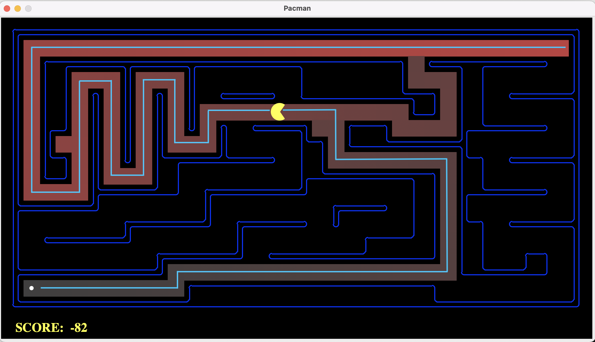
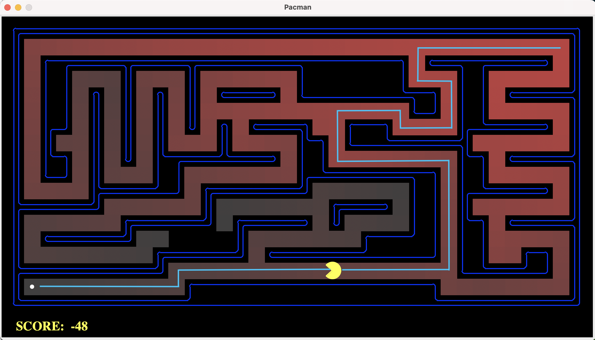
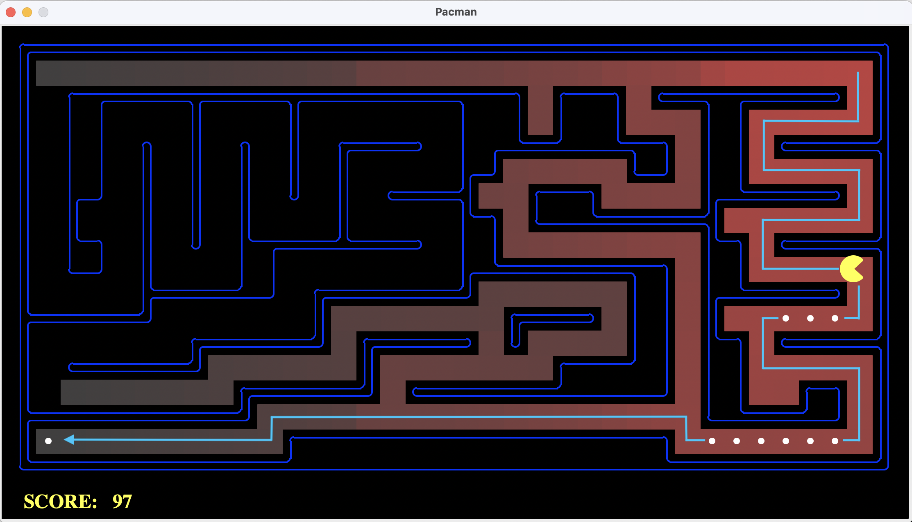
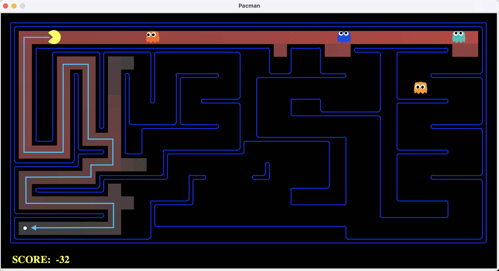
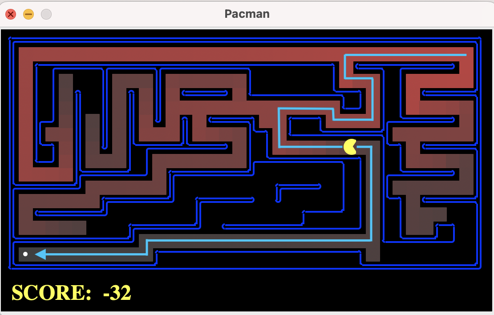
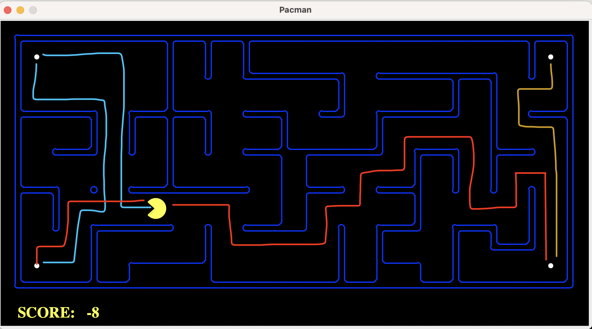
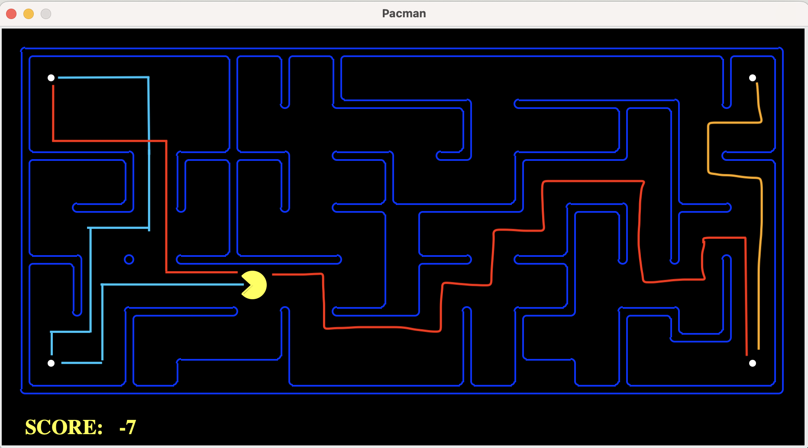
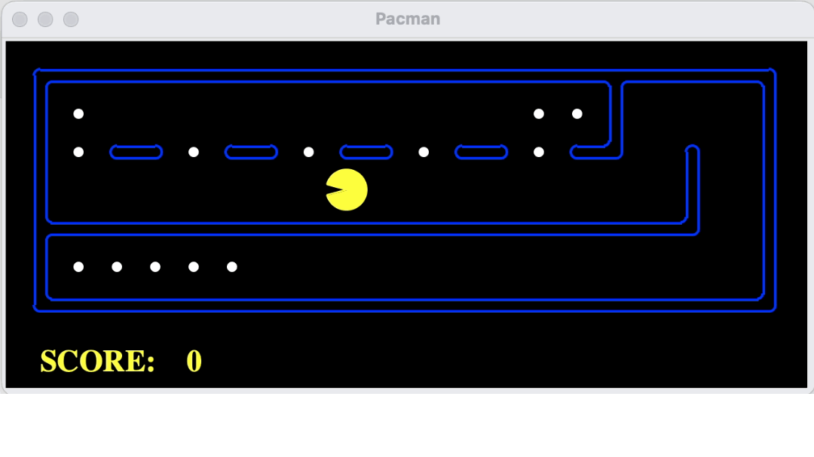
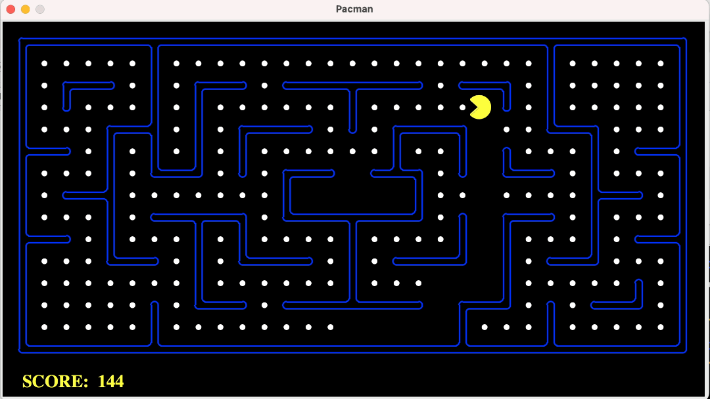

# Search Algorithms

In this project, the Pacman agent will find paths through his maze world, both to reach a particular location and to collect food efficiently. The general search algorithms (BFS, DFS, UCS, A*, Heuristic) will be applied to Pacman scenarios.

In `search.py` file, I implemented the __BFS, DFS, USC, A*, and Heuristic__ for pacman to have different routes and behaviors to collect dots and the costs.

<br>

Files of main algorithms:

| File               | Description                                                    |
|--------------------|----------------------------------------------------------------|
| `search.py`        | Where all of the search algorithms reside.               |
| `searchAgents.py`  | Where all of the search-based agents reside.             |

Files you might want to look at:

| File               | Description                                                                                        |
|--------------------|----------------------------------------------------------------------------------------------------|
| `pacman.py`        | The main file that runs Pacman games. This file describes a Pacman GameState type.|
| `game.py`          | The logic behind how the Pacman world works. This file describes several supporting types like AgentState, Agent, Direction, and Grid. |
| `util.py`          | Useful data structures for implementing search algorithms.                                          |

Supporting files you can ignore:

| File                  | Description                           |
|-----------------------|---------------------------------------|
| `graphicsDisplay.py`  | Graphics for Pacman                   |
| `graphicsUtils.py`    | Support for Pacman graphics           |
| `textDisplay.py`      | ASCII graphics for Pacman             |
| `ghostAgents.py`      | Agents to control ghosts              |
| `keyboardAgents.py`   | Keyboard interfaces to control Pacman |
| `layout.py`           | Code for reading layout files and storing their contents |
| `autograder.py`       | Project autograder                    |
| `testParser.py`       | Parses autograder test and solution files |
| `testClasses.py`      | General autograding test classes      |
| `test_cases/`         | Directory containing the test cases for each question |
| `searchTestClasses.py`| Project specific autograding test classes |

<br>

## 1. Finding a Fixed Food Dot using Depth First Search
In `searchAgents.py`, the fully implemented `SearchAgent` plans out a path through Pacman’s world and then executes that path step-by-step.

First, test that the `SearchAgent` is working correctly by running:
```bash
python pacman.py -l tinyMaze -p SearchAgent -a fn=tinyMazeSearch
```

Then, I [implemented](https://github.com/JC01111/Pacman-AI-Projects/blob/e8db8244dff0502f7ef5b24ba8d64a0bf9bda6c5/Search/search.py#L75) the __DFS on graph__ in `depthFirstSearch` function in `search.py`.
Now test the result by:
```python
python pacman.py -l tinyMaze -p SearchAgent
python pacman.py -l mediumMaze -p SearchAgent
python pacman.py -l bigMaze -z .5 -p SearchAgent
```
You should see the mediumMaze for **DFS** like this:



```
[SearchAgent] using function depthFirstSearch
[SearchAgent] using problem type PositionSearchProblem
Path found with total cost of 130 in 0.0 seconds
Search nodes expanded: 146
Pacman emerges victorious! Score: 380
Average Score: 380.0
Scores:        380.0
Win Rate:      1/1 (1.00)
Record:        Win
```

## 2. Breadth First Search
I [implemented](https://github.com/JC01111/Pacman-AI-Projects/blob/e8db8244dff0502f7ef5b24ba8d64a0bf9bda6c5/Search/search.py#L112) the __BFS on graph__ in the `breadthFirstSearch` function in `search.py`. 

We can test on the same way by running:
```python
python pacman.py -l mediumMaze -p SearchAgent -a fn=bfs
python pacman.py -l bigMaze -p SearchAgent -a fn=bfs -z .5
```

You should see the mediumMaze for **BFS** like this:



```
[SearchAgent] using function bfs
[SearchAgent] using problem type PositionSearchProblem
Path found with total cost of 68 in 0.0 seconds
Search nodes expanded: 269
Pacman emerges victorious! Score: 442
Average Score: 442.0
Scores:        442.0
Win Rate:      1/1 (1.00)
Record:        Win
```

## 3. Varying the Cost Function
UCS: an uninformed search that performs a search based on the loweset path cost.

While BFS will find a fewest-actions path to the goal, we might want to find paths that are “best” in other senses. Consider `mediumDottedMaze` and `mediumScaryMaze`.

By changing the cost function, we can encourage Pacman to find different paths. For example, we can charge more for dangerous steps in ghost-ridden areas or less for steps in food-rich areas, and a rational Pacman agent should adjust its behavior in response.

I [implemented](https://github.com/JC01111/Pacman-AI-Projects/blob/e8db8244dff0502f7ef5b24ba8d64a0bf9bda6c5/Search/search.py#L131) the __uniform-cost graph search algorithm__ in the `uniformCostSearch` function in `search.py`. The result of `UCS` is the same as `BFS`, which you can refer above.

We can run the tests by:
```python
python pacman.py -l mediumMaze -p SearchAgent -a fn=ucs
python pacman.py -l mediumDottedMaze -p StayEastSearchAgent
python pacman.py -l mediumScaryMaze -p StayWestSearchAgent
```

You should see the mediumDottedMaze:



which results in higher scores because we encourage pacman to eat more dots as part of our cost function.
```
Path found with total cost of 1 in 0.0 seconds
Search nodes expanded: 186
Pacman emerges victorious! Score: 646
Average Score: 646.0
Scores:        646.0
Win Rate:      1/1 (1.00)
Record:        Win
```

<br>

And the mediumScaryMaze:



```
Path found with total cost of 68719479864 in 0.0 seconds
Search nodes expanded: 108
Pacman emerges victorious! Score: 418
Average Score: 418.0
Scores:        418.0
Win Rate:      1/1 (1.00)
Record:        Win
```

## 4. A* search
A*: an informed search f(n) = g(n) + h(n). g(n) is the cost of the path from the start node to n, and h(n) is a heuristic function that estimates the cost of the cheapest path from n to the goal.

I [implemented](https://github.com/JC01111/Pacman-AI-Projects/blob/e8db8244dff0502f7ef5b24ba8d64a0bf9bda6c5/Search/search.py#L158) __A* graph search__ in the empty function `aStarSearch` in `search.py`. A* takes a heuristic function as an argument. Heuristics take two arguments: a state in the search problem (the main argument), and the problem itself (for reference information). The `nullHeuristic` heuristic function in `search.py` is a trivial example.

We can test the A* implementation on the original problem of finding a path through a maze to a fixed position using the Manhattan distance heuristic (implemented already as `manhattanHeuristic` in `searchAgents.py`).

```python
python pacman.py -l bigMaze -z .5 -p SearchAgent -a fn=astar,heuristic=manhattanHeuristic
```



A* finds the optimal solution slightly faster than uniform cost search (about 549 vs. 620 search nodes expanded in our implementation, but ties in priority may make your numbers differ slightly).

```
[SearchAgent] using function astar and heuristic manhattanHeuristic
[SearchAgent] using problem type PositionSearchProblem
Path found with total cost of 68 in 0.0 seconds
Search nodes expanded: 221
Pacman emerges victorious! Score: 442
Average Score: 442.0
Scores:        442.0
Win Rate:      1/1 (1.00)
Record:        Win
```

## 5. Finding All the Corners
The real power of A* will only be apparent with a more challenging search problem. Now, it’s time to formulate a new problem and design a heuristic for it.

In corner mazes, there are four dots, one in each corner. Our new search problem is to find the shortest path through the maze that touches all four corners (whether the maze actually has food there or not). Note that for some mazes like tinyCorners, the shortest path does not always go to the closest food first! Hint: the shortest path through tinyCorners takes 28 steps.

I [implemented](https://github.com/JC01111/Pacman-AI-Projects/blob/e8db8244dff0502f7ef5b24ba8d64a0bf9bda6c5/Search/searchAgents.py#L273) the `CornersProblem` search problem in `searchAgents.py`. We can test on:
```python
python pacman.py -l tinyCorners -p SearchAgent -a fn=bfs,prob=CornersProblem
python pacman.py -l mediumCorners -p SearchAgent -a fn=bfs,prob=CornersProblem
```
The blue line is the first route that pacman goes, red line is the second route, orange line is the third route.


```
[SearchAgent] using function bfs
[SearchAgent] using problem type CornersProblem
Path found with total cost of 106 in 0.0 seconds
Search nodes expanded: 1966
Pacman emerges victorious! Score: 434
Average Score: 434.0
Scores:        434.0
Win Rate:      1/1 (1.00)
Record:        Win
```

## 5.2 Corners Problem: Heuristic
__Admissibility vs. Consistency:__ Heuristics are just functions that take search states and return numbers that estimate the cost to a nearest goal. More effective heuristics will return values closer to the actual goal costs. To be _admissible_, the heuristic values must be lower bounds on the actual shortest path cost to the nearest goal (and non-negative). To be _consistent_, it must additionally hold that if an action has cost c, then taking that action can only cause a drop in heuristic of at most c.

Admissibility isn’t enough to guarantee correctness in graph search – you need the stronger condition of consistency. However, admissible heuristics are usually also consistent, especially if they are derived from problem relaxations. Therefore it is usually easiest to start out by brainstorming admissible heuristics. Once you have an admissible heuristic that works well, you can check whether it is indeed consistent, too. The only way to guarantee consistency is with a proof. However, inconsistency can often be detected by verifying that for each node you expand, its successor nodes are equal or higher in in f-value. Moreover, if UCS and A* ever return paths of different lengths, your heuristic is inconsistent. This stuff is tricky!

__Non-Trivial Heuristics:__ The trivial heuristics are the ones that return zero everywhere (UCS) and the heuristic which computes the true completion cost. The former won’t save you any time, while the latter will take longer. You want a heuristic which reduces total compute time, though we can also check node counts (aside from enforcing a reasonable time limit).

<br>

To get a better result, I [implemented](https://github.com/JC01111/Pacman-AI-Projects/blob/e8db8244dff0502f7ef5b24ba8d64a0bf9bda6c5/Search/searchAgents.py#L357) a non-trivial, consistent heuristic for the `CornersProblem` in `cornersHeuristic`.

```python
python pacman.py -l mediumCorners -p AStarCornersAgent
```
The blue line is the first route that pacman goes, red line is the second route, orange line is the third route.


This method expanded less than 1200 nodes, which is very good.
```
Path found with total cost of 106 in 0.0 seconds
Search nodes expanded: 1136
Pacman emerges victorious! Score: 434
Average Score: 434.0
Scores:        434.0
Win Rate:      1/1 (1.00)
Record:        Win
```

## 6. Eating All The Dots
Now we’ll solve a hard search problem: eating all the Pacman food in as few steps as possible. For this, we’ll need a new search problem definition which formalizes the food-clearing problem: `FoodSearchProblem` in `searchAgents.py` (implemented). A solution is defined to be a path that collects all of the food in the Pacman world. For the present project, solutions do not take into account any ghosts or power pellets; solutions only depend on the placement of walls, regular food and Pacman. (Of course ghosts can ruin the execution of a solution!) If you have written your general search methods correctly, A* with a null heuristic (equivalent to uniform-cost search) should quickly find an optimal solution to testSearch with no code change on your part (total cost of 7).

```python
python pacman.py -l testSearch -p AStarFoodSearchAgent
```

```
Path found with total cost of 7 in 0.0 seconds
Search nodes expanded: 10
Pacman emerges victorious! Score: 513
Average Score: 513.0
Scores:        513.0
Win Rate:      1/1 (1.00)
Record:        Win
```

<br>

I [implemented](https://github.com/JC01111/Pacman-AI-Projects/blob/e8db8244dff0502f7ef5b24ba8d64a0bf9bda6c5/Search/searchAgents.py#L450) in `foodHeuristic` in `searchAgents.py` with a _consistent_ heuristic for the `FoodSearchProblem`.
```python
python pacman.py -l trickySearch -p AStarFoodSearchAgent
```



```
Path found with total cost of 60 in 6.2 seconds
Search nodes expanded: 4137
Pacman emerges victorious! Score: 570
Average Score: 570.0
Scores:        570.0
Win Rate:      1/1 (1.00)
Record:        Win
```


## 7. Suboptimal Search
Sometimes, even with A* and a good heuristic, finding the optimal path through all the dots is hard. In these cases, we’d still like to find a reasonably good path, quickly. In this section, I wrote an agent that always greedily eats the closest dot. `ClosestDotSearchAgent` is implemented in searchAgents.py.

I implemented the function `findPathToClosestDot` in `searchAgents.py`. The agent solves this maze (suboptimally!) in under a second with a path cost of 350:



```
[SearchAgent] using function depthFirstSearch
[SearchAgent] using problem type PositionSearchProblem
Path found with cost 350.
Pacman emerges victorious! Score: 2360
Average Score: 2360.0
Scores:        2360.0
Win Rate:      1/1 (1.00)
Record:        Win
```
`ClosestDotSearchAgent` won’t always find the shortest possible path through the maze.
