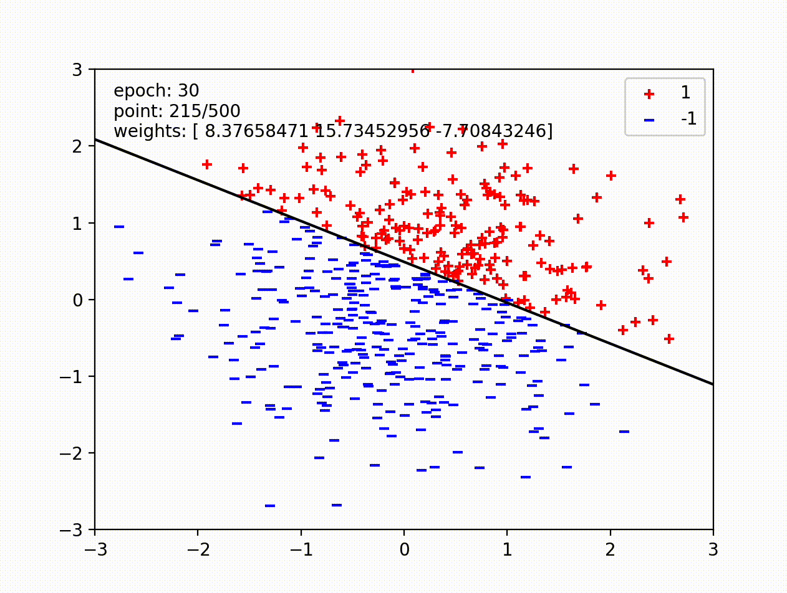
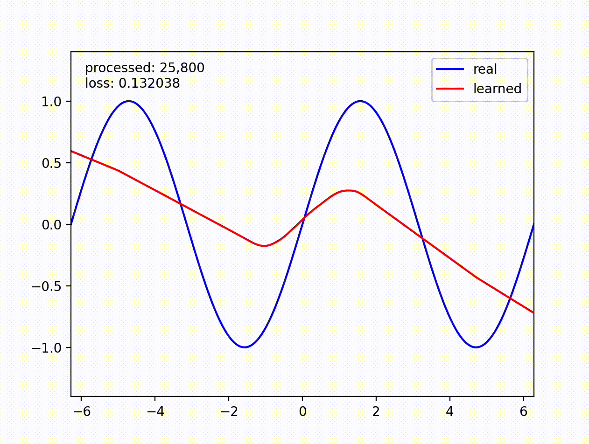
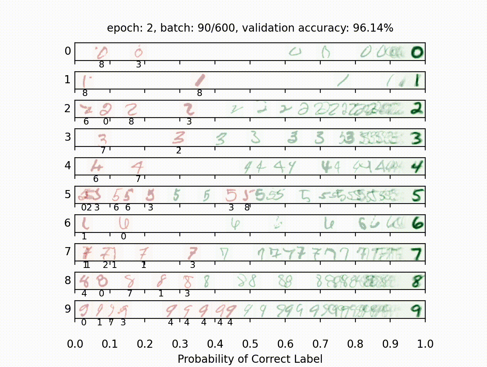

# Machine Learning
<p align="center">
    
</p>

## Overview
In this project, I built a neural network to classify digits, and language identification.

### Contents
1. [Perceptron](https://github.com/JC01111/Pacman-AI-Projects/tree/main/machinelearning#1-perceptron)
2. [Non-linear Regression](https://github.com/JC01111/Pacman-AI-Projects/tree/main/machinelearning#2-non-linear-regression)
3. [Digit Classification](https://github.com/JC01111/Pacman-AI-Projects/tree/main/machinelearning#3-digit-classification)
4. [Language Identification](https://github.com/JC01111/Pacman-AI-Projects/tree/main/machinelearning#4-language-identification)

___

Files of main algorithms:

| File         | Description                                                 |
|--------------|-------------------------------------------------------------|
| `models.py`  | Perceptron and neural network models for a variety of applications.|

Files you might want to look at:

| File         | Description                       |
|--------------|-----------------------------------|
| `nn.py`      | Neural network mini-library.      |

Supporting files you can ignore:

| File              | Description                                                         |
|-------------------|---------------------------------------------------------------------|
| `autograder.py`   | Project autograder.                                                 |
| `backend.py`      | Backend code for various machine learning tasks.                    |
| `data`            | Datasets for digit classification and language identification.      |

<br>

<br>

Before we begin, you need to install `NumPy` and `matplotlib` two libraries:
```bash
pip install numpy
pip install matplotlib
```

<br>

Check by running this command:
```python
python autograder.py --check-dependencies
```

And this window will pop up.
<p align="center">
    
</p>

## Provided Library
There is a provided neural network mini-library (`nn.py`) and a collection of datatsets(`backend.py`).

The library in `nn.py` defines a collection of node objects. Each node represents a real number or a matrix of real numbers. Operations on node objects are optimized to work faster than using Python’s built-in types (such as lists).

Here are a few of the provided node types:

- `nn.Constant` represents a matrix (2D array) of floating point numbers. It is typically used to represent input features or target outputs/labels.
- `nn.DotProduct` computes a dot product between its inputs. 

Here is an example of computing a dot product of x with itself, first as a node and then as a Python number.
```
>>> x
<Constant shape=4x2 at 0x10a30fe80>
>>> nn.DotProduct(x, x)
<DotProduct shape=1x1 at 0x11a89edd8>
>>> nn.as_scalar(nn.DotProduct(x, x))
1.9756581717465536
```

Some other important nodes:
- `nn.Parameter` represents a trainable parameter of a perceptron or neural network. All parameters must be 2-dimensional.
    - Usage: `nn.Parameter(n, m)` constructs a parameter with shape n by m.
- `nn.AddBias` adds a bias vector to each feature vector. Note: it automatically broadcasts the bias to add the same vector to every row of `features`.
  - Usage: `nn.AddBias(features, bias)` accepts `features` of shape `batch_size` by `num_features` and `bias` of shape 1 by `num_features`, and constructs a node that has shape `batch_size` by `num_features`.

- `nn.Linear` applies a linear transformation (matrix multiplication) to the input.
  - Usage: `nn.Linear(features, weights)` accepts `features` of shape `batch_size` by `num_input_features` and `weights` of shape `num_input_features` by `num_output_features`, and constructs a node that has shape `batch_size` by `num_output_features`.

- `nn.ReLU` applies the element-wise Rectified Linear Unit nonlinearity \( \text{relu}(x) = \max(x, 0) \). This nonlinearity replaces all negative entries in its input with zeros.
  - Usage: `nn.ReLU(features)`, which returns a node with the same shape as the input.

- `nn.SquareLoss` computes a batched square loss, used for regression problems.
  - Usage: `nn.SquareLoss(a, b)`, where `a` and `b` both have shape `batch_size` by `num_outputs`.

- `nn.SoftmaxLoss` computes a batched softmax loss, used for classification problems.
  - Usage: `nn.SoftmaxLoss(logits, labels)`, where `logits` and `labels` both have shape `batch_size` by `num_classes`. The term "logits" refers to scores produced by a model, where each entry can be an arbitrary real number. The labels, however, must be non-negative and have each row sum to 1. Be sure not to swap the order of the arguments!

- `nn.gradients` computes gradients of a loss with respect to provided parameters.
    - Usage: `nn.gradients(loss, [parameter_1, parameter_2, ..., parameter_n])` will return a list `[gradient_1, gradient_2, ..., gradient_n]`, where each element is an `nn.Constant` containing the gradient of the loss with respect to a parameter.

- `nn.as_scalar` can extract a Python floating-point number from a loss node. This can be useful to determine when to stop training.
  - Usage: `nn.as_scalar(node)`, where node is either a loss node or has shape (1,1).

The datasets provided also have two additional methods:

- `dataset.iterate_forever(batch_size)` yields an infinite sequence of batches of examples.
- `dataset.get_validation_accuracy()` returns the accuracy of your model on the validation set. This can be useful to determine when to stop training.

### Example: Linear Regression <br>
Suppose we have x has shape 4x2, we want m, b has shape 2x1, and 1x1.
```
>>> x
<Constant shape=4x2 at 0x10a30fe80>
>>> y
<Constant shape=4x1 at 0x10a30fef0>
```

```python
m = nn.Parameter(2, 1)
b = nn.Parameter(1, 1)

xm = nn.Linear(x, m)
predicted_y = nn.AddBias(xm, b)

loss = nn.SquareLoss(predicted_y, y)
grad_wrt_m, grad_wrt_b = nn.gradients(loss, [m, b])
```
```
>>> xm
<Linear shape=4x1 at 0x11a869588>
>>> predicted_y
<AddBias shape=4x1 at 0x11c23aa90>
>>> loss
<SquareLoss shape=() at 0x11c23a240>
>>> grad_wrt_m
<Constant shape=2x1 at 0x11a8cb160>
>>> grad_wrt_b
<Constant shape=1x1 at 0x11a8cb588>
```

## 1. Perceptron
In this part, I implemented a binary perceptron in [`PerceptronModel`](https://github.com/JC01111/Pacman-AI-Projects/blob/6a92c66b486501e8eb053cb6b76569ae4ad40586/machinelearning/models.py#L3) class in `models.py`. 

This class contains three parts: 
1. `run(self, x)` method, this method computes the dot product of the stored weight vector and the given input, returning an `nn.DotProduct` object.
 
2. `get_prediction(self, x)`, which returns 1 if the dot product is non-negative or −1 otherwise.

3. train(self) method. This repeatedly loops over the data set and makes updates on examples that are misclassified. It uses the `update` method of the `nn.Parameter` class to update the weights. When an entire pass over the data set is completed without making any mistakes, 100% training accuracy has been achieved, and training can terminate.

We call `parameter.update(direction, multiplier)` to perform the update to the weights:
$$\text{weights}\leftarrow \text{weights + direction} \cdot \text{multiplier}$$

Run this command to observe the perceptron updates:
```python
python autograder.py -q q1
```

<p align="center">


## 2. Non-linear Regression
For this part, I trained a neural network to approximate $\text{sin}(x)$ over $[-2\pi, 2\pi]$ by implementing [`RegressionModel`](https://github.com/JC01111/Pacman-AI-Projects/blob/6a92c66b486501e8eb053cb6b76569ae4ad40586/machinelearning/models.py#L55) class in `models.py` with `nn.SquareLoss` as loss function.

There are four parts of this class:
- `RegressionModel.__init__`with initialization.
- `RegressionModel.run` to return a batch_size by 1 node that represents your model’s prediction.
- `RegressionModel.get_loss` to return a loss for given inputs and target outputs.
- `RegressionModel.train` to train model using gradient-based updates.

I use this set of hyperparameters:
- Hidden layer size 512
- Batch size 200
- Learning rate 0.05
- One hidden layer (2 linear layers in total)

Watch this animination of training $\text{sin}(x)$ over $[-2\pi, 2\pi]$:
```python
python autograder.py -q q2
```
<p align="center">


## 3. Digit Classification
For this part, I trained a network to classify handwritten digits from the MNIST dataset.

Each digit is of size 28 by 28 pixels, the values of which are stored in a 784-dimensional vector of floating point numbers. Each output we provide is a 10-dimensional vector which has zeros in all positions, except for a one in the position corresponding to the correct class of the digit.

I implemented the [`DigitClassificationModel`](https://github.com/JC01111/Pacman-AI-Projects/blob/6a92c66b486501e8eb053cb6b76569ae4ad40586/machinelearning/models.py#L120) class in `models.py` with `nn.SoftmaxLoss` as loss function. The return value from `DigitClassificationModel.run()` is be a batch_size by 10 node containing scores, where higher scores indicate a higher probability of a digit belonging to a particular class (0-9).

I use this set of hyperparameters:
- Hidden layer size 200
- Batch size 100
- Learning rate 0.5
- One hidden layer (2 linear layers in total)

Watch this animation of digit classification:
```python
python autograder.py -q q3
```
<p align="center">


## 4. Language Identification
Language identification is the task of figuring out, given a piece of text, what language the text is written in. For example, your browser might be able to detect if you’ve visited a page in a foreign language and offer to translate it for you. Here is an example from Chrome (which uses a neural network to implement this feature):

<p align="center">


In this part, I built a small neural network model in [`LanguageIDModel`](https://github.com/JC01111/Pacman-AI-Projects/blob/6a92c66b486501e8eb053cb6b76569ae4ad40586/machinelearning/models.py#L204) that identifies language for one word at a time. The dataset consists of words in five languages, such as the table: 

| Word       | Language |
|------------|----------|
| discussed  | English  |
| eternidad  | Spanish  |
| itseänne   | Finnish  |
| paleis     | Dutch    |
| mieszkać   | Polish   |

Different words consist of different numbers of letters, so our model needs to have an architecture that can handle variable-length inputs. Instead of a single input $x$ (like in the previous questions), we’ll have a separate input for each character in the word: $x_0, x_1, \cdots, x_{L-1}$ where $L$ is the length of the word. We’ll start by applying a network $f_{\text{initial}}$ that is just like the networks in the previous problems. It accepts its input $x_0$ and computes an output vector $h_1$ of dimensionality $d$:

$$h_1 = f_{\text{initial}}(x_0)$$

Next, we’ll combine the output of the previous step with the next letter in the word, generating a vector summary of the first two letters of the word. To do this, we’ll apply a sub-network that accepts a letter and outputs a hidden state, but now also depends on the previous hidden state $h_1$. We denote this sub-network as $f$.

$$h_2 = f(h_1, x_1)$$

This pattern continues for all letters in the input word, where the hidden state at each step summarizes all the letters the network has processed thus far:

$$h_3 = f(h_2, x_2)$$
$$\vdots$$

Throughout these computations, the function $f(\cdot, \cdot)$ is the same piece of neural network and uses the same trainable parameters; $f_{\text{initial}}$ will also share some of the same parameters as $f(\cdot, \cdot)$. In this way, the parameters used when processing words of different lengths are all shared. You can implement this using a for loop over the provided inputs `xs`, where each iteration of the loop computes either $f_{\text{initial}}$ or $f$.

The technique described above is called a Recurrent Neural Network (RNN). A schematic diagram of the RNN is shown below:

<p align="center">


Here, an RNN is used to encode the word "cat" into a fixed-size vector $h_3$.

After the RNN has processed the full length of the input, it has encoded the arbitrary-length input word into a fixed-size vector $h_L$, where $L$ is the length of the word. This vector summary of the input word can now be fed through additional output transformation layers to generate classification scores for the word’s language identity.

### My Steps

Here are some steps of my design of the recurrent function $f(\cdot, \cdot)$:

- Start with an architecture $f_{\text{initial}}(x)$ similar to the previous questions, as long as it has at least one non-linearity.
- I use the following method of constructing $f(\cdot, \cdot)$ given $f_{\text{initial}}(x)$. The first transformation layer of $f_{\text{initial}}$ will begin by multiplying the vector $x_0$ by some weight matrix $\mathbf{W}_x$ to produce $z_0 = x_0 \cdot \mathbf{W}_x$. For subsequent letters, I replace this computation with $z_i = x_i \cdot \mathbf{W}_x + h_i \cdot \mathbf{W}_{\text{hidden}}$ using an `nn.Add` operation. In other words, I replace a computation of the form `z0 = nn.Linear(x, W)` with a computation of the form `z = nn.Add(nn.Linear(x, W), nn.Linear(h, W_hidden))`.
- After these steps, the resulting function $f(x_i, h_i) = g(z_i) = g(z_{x_i, h_i})$ will be non-linear in both $x $ and $h$.
- The hidden size $d$ should be sufficiently large.
- Start with a shallow network for $f$, and figure out good values for the hidden size and learning rate before you make the network deeper. If you start with a deep network right away you will have exponentially more hyperparameter combinations, and getting any single hyperparameter wrong can cause performance to suffer dramatically.

My set of hyperparameters:
- Hidden layer size 256
- Batch size 128
- Learning rate 0.075
- Three hidden layers

And I use `nn.SoftmaxLoss()` as loss function.

Watch the language identification training by running: 
```python
python autograder.py -q q4
```

<p align="center">
