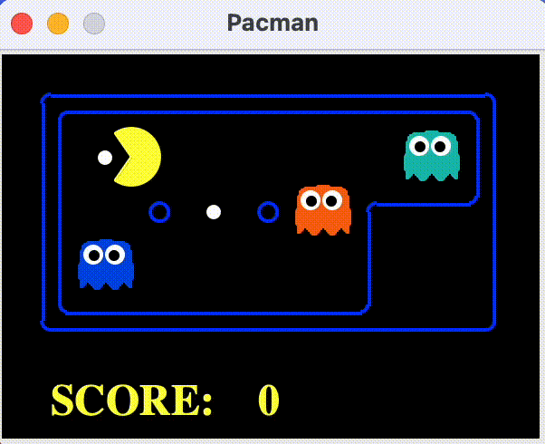
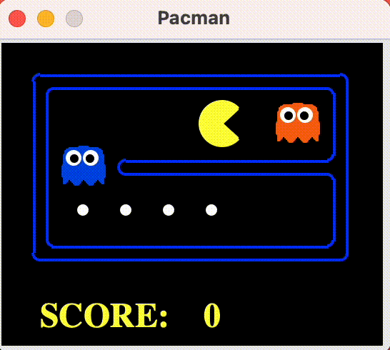

# Multi-Agent Search
<p align="center">
    
</p>

$$\text{Pacman, now with ghosts.
Minimax, Expectimax,
Evaluation}$$

## Overview

In this project, I designed agents for the classic version of Pacman, including ghosts. Along the way, I implemented both **minimax** and **expectimax** search and try my hands at evaluation function design.

### Contents
1. [Reflex Agent](https://github.com/JC01111/Pacman-AI-Projects/tree/main/multiagent#1-reflex-agent)
2. [Minimax](https://github.com/JC01111/Pacman-AI-Projects/tree/main/multiagent#2-minimax)
3. [Alpha-Beta Pruning](https://github.com/JC01111/Pacman-AI-Projects/tree/main/multiagent#3-alpha-beta-pruning)
4. [Expectimax](https://github.com/JC01111/Pacman-AI-Projects/tree/main/multiagent#4-expectimax)
5. [Evaluation Function](https://github.com/JC01111/Pacman-AI-Projects/tree/main/multiagent#5-evaluation-function)

___

File of main algorithms:

| File               | Description                                           |
|--------------------|-------------------------------------------------------|
| `multiAgents.py`   | Where all of your multi-agent search agents will reside.|

Files you might want to look at:

| File          | Description                                                                                     |
|---------------|-------------------------------------------------------------------------------------------------|
| `pacman.py`   | The main file that runs Pacman games. This file also describes a Pacman GameState type, which you will use extensively in this project.|
| `game.py`     | The logic behind how the Pacman world works. This file describes several supporting types like AgentState, Agent, Direction, and Grid.|
| `util.py`     | Useful data structures for implementing search algorithms. You don't need to use these for this project, but may find other functions defined here to be useful.|

Supporting files you can ignore:

| File                        | Description                                                                      |
|-----------------------------|----------------------------------------------------------------------------------|
| `graphicsDisplay.py`        | Graphics for Pacman                                                              |
| `graphicsUtils.py`          | Support for Pacman graphics                                                      |
| `textDisplay.py`            | ASCII graphics for Pacman                                                        |
| `ghostAgents.py`            | Agents to control ghosts                                                         |
| `keyboardAgents.py`         | Keyboard interfaces to control Pacman                                            |
| `layout.py`                 | Code for reading layout files and storing their contents                         |
| `autograder.py`             | Project autograder                                                               |
| `testParser.py`             | Parses autograder test and solution files                                        |
| `testClasses.py`            | General autograding test classes                                                 |
| `test_cases/`               | Directory containing the test cases for each question                            |
| `multiagentTestClasses.py`  | Project 3 specific autograding test classes                                      |

<br>

## 1. Reflex Agent
I implemented the [`ReflexAgent`](https://github.com/JC01111/Pacman-AI-Projects/blob/4b60154e48c6b6bf26c7dd2de9cf8a7f072270a9/multiagent/multiAgents.py#L22) in `multiAgents.py`, this reflex agent considers both food locations and ghost locations to perform well.

The agent should easily and reliably clear the `testClassic` layout:
```python
python pacman.py -p ReflexAgent -l testClassic
```

 <br>

Try the reflex agent on the default `mediumClassic` layout with one ghosts or two (and animation off to speed up the display):
```python
python pacman.py --frameTime 0 -p ReflexAgent -k 1
```

 <br>

The reflex agent will likely often die with 2 ghosts.
```python
python pacman.py --frameTime 0 -p ReflexAgent -k 2
```


 <br>

## 2. Minimax
I implemented an adversarial search agent in [`MinimaxAgent`](https://github.com/JC01111/Pacman-AI-Projects/blob/4b60154e48c6b6bf26c7dd2de9cf8a7f072270a9/multiagent/multiAgents.py#L124) in `multiAgents.py`. This minimax agent works with any number of ghosts.  In particular, the minimax tree will have multiple min layers (one for each ghost) for every max layer.

A single search ply is considered to be one Pacman move and all the ghosts’ responses, so depth 2 search will involve Pacman and each ghost moving two times (see diagram below).

 <br>

The minimax values of the initial state in the `minimaxClassic` layout are 9, 8, 7, -492 for depths 1, 2, 3 and 4 respectively. Note that your minimax agent will often win (665/1000 games for us) despite the dire prediction of depth 4 minimax.

Below are the two scenarios when the agent succeeds and fails
```python
python pacman.py -p MinimaxAgent -l minimaxClassic -a depth=4
```

<div style="display: flex; align-items: center;">
  
  
</div>
<br>

On larger boards such as `openClassic` and `mediumClassic` (the default), you’ll find Pacman to be good at not dying, but quite bad at winning. He’ll often thrash around without making progress. He might even thrash around right next to a dot without eating it because he doesn’t know where he’d go after eating that dot. 

When Pacman believes that his death is unavoidable, he will try to end the game as soon as possible because of the constant penalty for living. Sometimes, this is the wrong thing to do with random ghosts, but minimax agents always assume the worst:
```python
  python pacman.py -p MinimaxAgent -l trappedClassic -a depth=3
```

 <br>

## 3. Alpha-Beta Pruning
Now, we make a new agent that uses alpha-beta pruning to more efficiently explore the minimax tree, in [`AlphaBetaAgent`](https://github.com/JC01111/Pacman-AI-Projects/blob/4b60154e48c6b6bf26c7dd2de9cf8a7f072270a9/multiagent/multiAgents.py#L191), this alpha-beta pruning logic applies to multiple minimizer agents.

The pseudo-code of the algorithm:

<p align="center">
    
</p>

```python
python pacman.py -p AlphaBetaAgent -a depth=3 -l smallClassic
```
<p align="center">


We can see above the behavior is correct even though Pacman will lose the games.

## 4. Expectimax
Minimax and alpha-beta are great, but they both assume that you are playing against an adversary who makes optimal decisions. As anyone who has ever won tic-tac-toe can tell you, this is not always the case. In this part I implemented the [`ExpectimaxAgent`](https://github.com/JC01111/Pacman-AI-Projects/blob/4b60154e48c6b6bf26c7dd2de9cf8a7f072270a9/multiagent/multiAgents.py#L248), which is useful for modeling probabilistic behavior of agents who may make suboptimal choices.

We can test the implementation on game trees by:
```python
python autograder.py -q q4
```
<p align="center">
 <br>

Now, we can observe the expectimax in Pacman. Random ghosts are of course not optimal minimax agents, and so modeling them with minimax search may not be appropriate. `ExpectimaxAgent` will no longer take the min over all ghost actions, but the expectation according to your agent’s model of how the ghosts act. 

Run the command to see the Pacman succeeds and fails by using expectimax.
```python
python pacman.py -p ExpectimaxAgent -l minimaxClassic -a depth=3
```

<div style="display: flex; align-items: center;">
  
  
</div>
<br>

We should now observe a more cavalier approach in close quarters with ghosts. In particular, if Pacman perceives that he could be trapped but might escape to grab a few more pieces of food, he’ll at least try. Investigate the results of these two scenarios:
```python
python pacman.py -p AlphaBetaAgent -l trappedClassic -a depth=3 -q -n 10
```
```
Pacman died! Score: -501
Pacman died! Score: -501
Pacman died! Score: -501
Pacman died! Score: -501
Pacman died! Score: -501
Pacman died! Score: -501
Pacman died! Score: -501
Pacman died! Score: -501
Pacman died! Score: -501
Pacman died! Score: -501
Average Score: -501.0
Scores:        -501.0, -501.0, -501.0, -501.0, -501.0, -501.0, -501.0, -501.0, -501.0, -501.0
Win Rate:      0/10 (0.00)
Record:        Loss, Loss, Loss, Loss, Loss, Loss, Loss, Loss, Loss, Loss
```

```python
python pacman.py -p ExpectimaxAgent -l trappedClassic -a depth=3 -q -n 10
```
```
Pacman died! Score: -502
Pacman emerges victorious! Score: 532
Pacman emerges victorious! Score: 532
Pacman emerges victorious! Score: 532
Pacman died! Score: -502
Pacman died! Score: -502
Pacman died! Score: -502
Pacman emerges victorious! Score: 532
Pacman emerges victorious! Score: 532
Pacman emerges victorious! Score: 532
Average Score: 118.4
Scores:        -502.0, 532.0, 532.0, 532.0, -502.0, -502.0, -502.0, 532.0, 532.0, 532.0
Win Rate:      6/10 (0.60)
Record:        Loss, Win, Win, Win, Loss, Loss, Loss, Win, Win, Win
```

We find that `ExpectimaxAgent` wins about half the time, while `AlphaBetaAgent` always loses.

## 5. Evaluation Function
I wrote a better evaluation function for Pacman in [`betterEvaluationFunction`](https://github.com/JC01111/Pacman-AI-Projects/blob/4b60154e48c6b6bf26c7dd2de9cf8a7f072270a9/multiagent/multiAgents.py#L303). The evaluation function evaluates states, rather than actions of reflex agent evaluation function did. And this evaluation function clears the smallClassic layout with one random ghost more than half the time and still run at a reasonable rate.

Here I will show you one game that the Pacman using this `betterEvaluatonFucntion`.
```python
python autograder.py -q q5
```
<p align="center">
 <br>

Finally, run this without graphics to check to run the agent on the smallClassic layout 10 times.
```python
python autograder.py -q q5 --no-graphics
```

This is the final result:
```
Pacman emerges victorious! Score: 1325
Pacman emerges victorious! Score: 1196
Pacman emerges victorious! Score: 1254
Pacman emerges victorious! Score: 1224
Pacman emerges victorious! Score: 1324
Pacman emerges victorious! Score: 1146
Pacman emerges victorious! Score: 1212
Pacman emerges victorious! Score: 1295
Pacman emerges victorious! Score: 1333
Pacman emerges victorious! Score: 1340
Average Score: 1264.9
Scores:        1325.0, 1196.0, 1254.0, 1224.0, 1324.0, 1146.0, 1212.0, 1295.0, 1333.0, 1340.0
Win Rate:      10/10 (1.00)
Record:        Win, Win, Win, Win, Win, Win, Win, Win, Win, Win
```