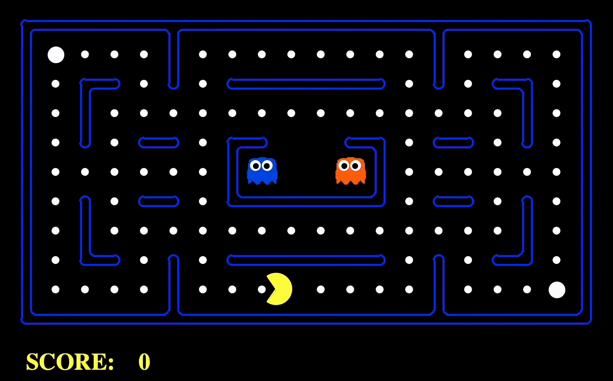

# Reinforcement Learning
<p align="center">
     <br>
</p>

In this project, the Pacman agent will find paths through his maze world, both to reach a particular location and to collect food efficiently. The value iteration and Q-learning of Reinforcement Learning techniques will be applied to pacman scenarios for pacman to have different routes and behaviors to collect dots and the costs.

Click on the [implemented]() (example) to look at specific function.

<br>

Files of main algorithms:

| File                     | Description                                                       |
|--------------------------|-------------------------------------------------------------------|
| `valueIterationAgents.py`| A value iteration agent for solving known MDPs.                   |
| `qlearningAgents.py`     | Q-learning agents for Gridworld, Crawler and Pacman.              |
| `analysis.py`            | A file to put your answers to questions given in the project.     |

Files you might want to look at:

| File                     | Description                                                                                         |
|--------------------------|-----------------------------------------------------------------------------------------------------|
| `mdp.py`                 | Defines methods on general MDPs.                                                                    |
| `learningAgents.py`      | Defines the base classes `ValueEstimationAgent` and `QLearningAgent`, which your agents will extend.|
| `util.py`                | Utilities, including `util.Counter`, which is particularly useful for Q-learners.                   |
| `gridWorld.py`           | The Gridworld implementation.                                                                       |
| `featureExtractors.py`   | Classes for extracting features on (state, action) pairs. Used for the approximate Q-learning agent (in `qlearningAgents.py`).|

Supporting files you can ignore:

| File                      | Description                                                                                        |
|---------------------------|----------------------------------------------------------------------------------------------------|
| `environment.py`          | Abstract class for general reinforcement learning environments. Used by `gridWorld.py`.            |
| `graphicsGridworldDisplay.py`| Gridworld graphical display.                                                                   |
| `graphicsUtils.py`        | Graphics utilities.                                                                               |
| `textGridworldDisplay.py` | Plug-in for the Gridworld text interface.                                                         |
| `crawler.py`              | The crawler code and test harness. You will run this but not edit it.                              |
| `graphicsCrawlerDisplay.py`| GUI for the crawler robot.                                                                        |
| `autograder.py`           | Project autograder.                                                                               |
| `testParser.py`           | Parses autograder test and solution files.                                                        |
| `testClasses.py`          | General autograding test classes.                                                                 |
| `test_cases/`             | Directory containing the test cases for each question.                                            |
| `reinforcementTestClasses.py`| Project 3 specific autograding test classes.                                                   |

<br>
Useful commands: 
`-i` indictates how many iterations to run. `-k` indicates how many times to execute. `-m` for manual control. `-e` for epsilon value (0-1). `-l` for learning rate.

<br>

## 1. Value Iteration

The Bellman equation for value iteration state update is given by:

$$ V_{k+1}(s) \leftarrow \max_{a} \sum_{s'} T(s, a, s') \left[ R(s, a, s') + \gamma V_k(s') \right] $$

I first [wrote](https://github.com/JC01111/Pacman-AI-Projects/blob/d5a9f975cb093dc2b435a2e908bd685593748900/reinforcement/valueIterationAgents.py#L62) a value iteration agent in `ValueIterationAgent`, this is an offline planner, not a reinforcement learning agent. `ValueIterationAgent` takes an MDP on construction and runs value iteration for the specified number of iterations before the constructor returns.

Value iteration computes _k_-step estimates of the optimal values, $V_k$. In addition to `runValueIteration`, I also implemented the following methods for `ValueIterationAgent` using $V_k$:

- [`computeActionFromValues(state)`](https://github.com/JC01111/Pacman-AI-Projects/blob/d5a9f975cb093dc2b435a2e908bd685593748900/reinforcement/valueIterationAgents.py#L97) computes the best action according to the value function given by `self.values`.
- [`computeQValueFromValues(state, action)`](https://github.com/JC01111/Pacman-AI-Projects/blob/d5a9f975cb093dc2b435a2e908bd685593748900/reinforcement/valueIterationAgents.py#L85) returns the Q-value of the (state, action) pair given by the value function given by `self.values`.

We can test the implementation by:
```python
python gridworld.py -a value -i 100 -k 10
python gridworld.py -a value -i 5
```
<p align="center">


```
EPISODE 1 COMPLETE: RETURN WAS 0.47829690000000014

AVERAGE RETURNS FROM START STATE: 0.47829690000000014
```

## 2. Policies
Now we have a `DiscountGrid` layout, shown below.  This grid has two terminal states with positive payoff (in the middle row), a close exit with payoff +1 and a distant exit with payoff +10. The bottom row of the grid consists of terminal states with negative payoff (shown in red); each state in this “cliff” region has payoff -10. The starting state is the yellow square. We distinguish between two types of paths: (1) paths that “risk the cliff” and travel near the bottom row of the grid; these paths are shorter but risk earning a large negative payoff, and are represented by the red arrow in the figure below. (2) paths that “avoid the cliff” and travel along the top edge of the grid. These paths are longer but are less likely to incur huge negative payoffs. These paths are represented by the green arrow in the figure below.
<p align="center">


<br>

Now we want to choose settings of the __discount, noise, and living reward__ parameters for this MDP to produce optimal policies of several different types. The setting of the parameter values for each part should have the property that, if the agent followed its optimal policy without being subject to any noise, it would exhibit the given behavior. If a particular behavior is not achieved for any setting of the parameters, assert that the policy is impossible by returning the string 'NOT POSSIBLE'.

1. Prefer the close exit (+1), risking the cliff (-10): <br>
    discount = 0.4, noise = 0.01, livingReward = -0.8
    
    Which can be tested by running:
   ```python
   python gridworld.py -g DiscountGrid -a value --discount 0.4 --noise 0.01 --livingReward -0.8
   ```
    <p align="center">
    

3. Prefer the close exit (+1), but avoiding the cliff (-10): <br>
    discount = 0.01, noise = 0.01, livingReward = 0.9
    
    Which can be tested by running:
   ```python
   python gridworld.py -g DiscountGrid -a value --discount 0.01 --noise 0.01 --livingReward 0.9
   ```
    <p align="center">
    

5. Prefer the distant exit (+10), risking the cliff (-10): <br>
    discount = 0.8, noise = 0.01, livingReward = -0.8
    
    Which can be tested by running:
   ```python
   python gridworld.py -g DiscountGrid -a value --discount 0.8 --noise 0.01 --livingReward -0.8
   ```
    <p align="center">
    

7. Prefer the distant exit (+10), avoiding the cliff (-10): <br>
    discount = 0.9, noise = 0.2, livingReward = 0.9
    
    Which can be tested by running:
    ```python
   python gridworld.py -g DiscountGrid -a value --discount 0.9 --noise 0.2 --livingReward 0.9
    ```
    <p align="center">
    

9. Avoid both exits and the cliff (so an episode should never terminate): <br>
    discount = 1, noise = 0.8, livingReward = 0.9 
    
    Which can be tested by running:
   ```python
   python gridworld.py -g DiscountGrid -a value --discount 1 --noise 0.8 --livingReward 0.9
   ```
    <p align="center">
    

The lower discount means short-sighted, higher discount focuses more on future (go further).
Lower noise means more deterministic, higher noise will lead to more random moves.
Negative livingReward discourages to live longer (takes shorter steps), but higher livingReward encourages live long, take longer action.

## 3. Prioritized Sweeping Value Iteration
In this part I implemented a simplified version of the standard [prioritized sweeping algorithm](https://proceedings.neurips.cc/paper_files/paper/1992/file/55743cc0393b1cb4b8b37d09ae48d097-Paper.pdf) in [`PrioritizedSweepingValueIterationAgent`](https://github.com/JC01111/Pacman-AI-Projects/blob/90334c76d82822979825107c23367c4eb421666d/reinforcement/valueIterationAgents.py#L124) in `valueIterationAgents.py`. 

Here's the algorithm of my implementation:
- First, we define the predecessors of a state `s` as all states that have a nonzero probability of reaching `s` by taking some action `a`. Also, `theta`, which is passed in as a parameter, will represent our tolerance for error when deciding whether to update the value of a state.
- Compute predecessors of all states.
- Initialize an empty priority queue.
- For each non-terminal state `s`, do:
  - Find the absolute value of the difference between the current value of `s` in `self.values` and the highest Q-value across all possible actions from `s` (this represents what the value should be); call this number `diff`. Do NOT update `self.values[s]` in this step.
  - Push `s` into the priority queue with priority `-diff` (note that this is negative). We use a negative because the priority queue is a min heap, but we want to prioritize updating states that have a higher error.
- For `iteration` in `0, 1, 2, ..., self.iterations - 1`, do:
  - If the priority queue is empty, then terminate.
  - Pop a state `s` off the priority queue.
  - Update the value of `s` (if it is not a terminal state) in `self.values`.
  - For each predecessor `p` of `s`, do:
    - Find the absolute value of the difference between the current value of `p` in `self.values` and the highest Q-value across all possible actions from `p` (this represents what the value should be); call this number `diff`. Do NOT update `self.values[p]` in this step.
    - If `diff > theta`, push `p` into the priority queue with priority `-diff` (note that this is negative), as long as it does not already exist in the priority queue with equal or lower priority. As before, we use a negative because the priority queue is a min heap, but we want to prioritize updating states that have a higher error.

We can run the `PrioritizedSweepingValueIterationAgen`` in the Gridworld using the following command:
```python
python gridworld.py -a priosweepvalue -i 1000
```
<p align="center">


```
EPISODE 1 COMPLETE: RETURN WAS 0.5904900000000002


AVERAGE RETURNS FROM START STATE: 0.5904900000000002
```

## 4. Q-Learning
Note that the value iteration agent does not actually learn from experience. Rather, it ponders its MDP model to arrive at a complete policy before ever interacting with a real environment. When it does interact with the environment, it simply follows the precomputed policy (e.g. it becomes a reflex agent). This distinction may be subtle in a simulated environment like a Gridword, but it’s very important in the real world, where the real MDP is not available.

Next, I implemented a Q-learning agent, which does very little on construction, but instead learns by trial and error from interactions with the environment through its `update(state, action, nextState, reward)` method. A stub of a Q-learner is specified in `QLearningAgent` in `qlearningAgents.py`, and you can select it with the option `'-a q'`. For this part, I implemented the [`update`](https://github.com/JC01111/Pacman-AI-Projects/blob/e34fcde562984ae3dcedf562a2ba4693fd781d8b/reinforcement/qlearningAgents.py#L109), [`computeValueFromQValues`](https://github.com/JC01111/Pacman-AI-Projects/blob/e34fcde562984ae3dcedf562a2ba4693fd781d8b/reinforcement/qlearningAgents.py#L59), [`getQValue`](https://github.com/JC01111/Pacman-AI-Projects/blob/e34fcde562984ae3dcedf562a2ba4693fd781d8b/reinforcement/qlearningAgents.py#L49), and [`computeActionFromQValues`](https://github.com/JC01111/Pacman-AI-Projects/blob/e34fcde562984ae3dcedf562a2ba4693fd781d8b/reinforcement/qlearningAgents.py#L73) methods.

With the Q-learning update in place, we can watch the Q-learner learn under manual control:
```python
python gridworld.py -a q -k 5 -m
```
<p align="center">


```
EPISODE 5 COMPLETE: RETURN WAS 0.5904900000000002

AVERAGE RETURNS FROM START STATE: 0.5562415800000002
```

## 5. Epsilon and Learning Rate
Now we can complete the Q-learning agent by implementing epsilon-greedy selection in [`getAction`](https://github.com/JC01111/Pacman-AI-Projects/blob/e34fcde562984ae3dcedf562a2ba4693fd781d8b/reinforcement/qlearningAgents.py#L86), meaning it chooses random actions an epsilon fraction of the time, and follows its current best Q-values otherwise. Note that choosing a random action may result in choosing the best action - that is, you should not choose a random sub-optimal action, but rather any random legal action.

After implementing the `getAction` method, observe the following behavior of the agent in GridWorld for different epsilon values:
```python
python gridworld.py -a q -k 100 --noise 0.0 -e 0.1
```
<p align="center">


```python
python gridworld.py -a q -k 100 --noise 0.0 -e 0.9
```
<p align="center">
 <br>

We can observe that smaller epsilon value encourages exploit than explore. The higher epsilon value makes the agent more greedy, so we are continuely improving the scores for each small grids, which makes sense for the above different behaviors.

There is another parameter `learningRate`,it controls how much recent information should be considered, lower `learningRate` discourages exploring.

Now, back to the bridge crossing problem. We can modify `-e` and `-l` to observe if there is an epsilon and a learning rate for which it is highly likely (greater than 99%) that the optimal policy will be learned after 50 iterations? The anwswer is **NO** for this question. 

```python
python gridworld.py -a q -k 50 -n 0 -g BridgeGrid -e 0.8 -l 0.7
```
<p align="center">


## 6. Q-Learning and Pacman
Time to play some Pacman! Pacman will play games in two phases. In the first phase, _training_, Pacman will begin to learn about the values of positions and actions. Because it takes a very long time to learn accurate Q-values even for tiny grids, Pacman’s training games run in quiet mode by default, with no GUI (or console) display. Once Pacman’s training is complete, he will enter testing mode. When testing, Pacman’s `self.epsilon` and `self.alpha` will be set to 0.0, effectively stopping Q-learning and disabling exploration, in order to allow Pacman to exploit his learned policy. Test games are shown in the GUI by default. Without any code changes you should be able to run Q-learning Pacman for very tiny grids as follows:

`-x` for total number of games for training, and it will not be displayed. `-n` for total number of games will be played. In this following command, I will show the last 5 games, it is also passed to the agent as option `numTraining`.
```python
python pacman.py -p PacmanQAgent -x 2000 -n 2005 -l smallGrid
```
<p align="center">
 <br>

`PacmanQAgent` is defined in terms of the `QLearningAgent`. `PacmanQAgent` is only different in that it has default learning parameters that are more effective for the Pacman problem (`epsilon=0.05, alpha=0.2, gamma=0.8`). 

_Note_: If you want to experiment with learning parameters, you can use the option `-a`, for example `-a epsilon=0.1,alpha=0.3,gamma=0.7`. These values will then be accessible as `self.epsilon, self.gamma and self.alpha` inside the agent.

Use this command to watch 5 training games:
```python
python pacman.py -p PacmanQAgent -n 5 -l smallGrid -a numTraining=5
```
<p align="center">
 <br>

During training, you will see output every 100 games with statistics about how Pacman is faring. Epsilon is positive during training, so Pacman will play poorly even after having learned a good policy: this is because he occasionally makes a random exploratory move into a ghost. As a benchmark, it should take between 1000 and 1400 games before Pacman’s rewards for a 100 episode segment becomes positive, reflecting that he’s started winning more than losing. By the end of training, it should remain positive and be fairly high (between 100 and 350).

Make sure you understand what is happening here: the MDP state is the exact board configuration facing Pacman, with the now complex transitions describing an entire ply of change to that state. The intermediate game configurations in which Pacman has moved but the ghosts have not replied are not MDP states, but are bundled in to the transitions.

Once Pacman is done training, he should win very reliably in test games (at least 90% of the time), since now he is exploiting his learned policy.

However, you will find that training the same agent on the seemingly simple `mediumGrid` does not work well. In our implementation, Pacman’s average training rewards remain negative throughout training. At test time, he plays badly, probably losing all of his test games. Training will also take a long time, despite its ineffectiveness.

Pacman fails to win on larger layouts because each board configuration is a separate state with separate Q-values. He has no way to generalize that running into a ghost is bad for all positions. Obviously, this approach will not scale.

## 7. Approximate Q-Learning
Next, I implemented an approximate Q-learning agent that learns weights for features of states, where many states might share the same features. Look at my implementation in [`ApproximateQAgent`](https://github.com/JC01111/Pacman-AI-Projects/blob/e34fcde562984ae3dcedf562a2ba4693fd781d8b/reinforcement/qlearningAgents.py#L165) class in `qlearningAgents.py`, which is a subclass of `PacmanQAgent`.

Approximate Q-learning assumes the existence of a feature function $f(s, a)$ over state and action pairs, which yields a vector $[f_1(s, a), \ldots, f_i(s, a), \ldots, f_n(s, a)]$ of feature values. There are feature functions in `featureExtractors.py`. Feature vectors are util.Counter (like a dictionary) objects containing the non-zero pairs of features and values; all omitted features have value zero. So, instead of an vector where the index in the vector defines which feature is which, we have the keys in the dictionary define the idenity of the feature.

The approximate Q-function takes the following form:

$$Q(s, a) = \sum_{i=1}^n f_i(s, a) w_i$$

where each weight $w_i$ is associated with a particular feature $f_i(s, a)$. In my code, I implemented the weight vector as a dictionary mapping features (which the feature extractors will return) to weight values. The way to update the weight vectors similarly to how we updated Q-values:

$$ w_i \leftarrow w_i + \alpha \cdot \text{difference} \cdot f_i(s, a) $$
$$ \text{difference} = \left( r + \gamma \max_{a'} Q(s', a') \right) - Q(s, a) $$

Note that the **difference** term is the same as in normal Q-learning, and $r$ is the experienced reward.

By default, `ApproximateQAgent` uses the `IdentityExtractor`, which assigns a single feature to every `(state, action)` pair. With this feature extractor, the approximate Q-learning agent should work identically to `PacmanQAgent`. 

We can test this with the following command, and you should see identical result as `PacmanQAgent` above:
```bash
python pacman.py -p ApproximateQAgent -x 2000 -n 2010 -l smallGrid
```

Now, we can test the approximate Q-learning agent with custom feature extractor, which can learn to win with ease:
```bash
python pacman.py -p ApproximateQAgent -a extractor=SimpleExtractor -x 50 -n 55 -l mediumGrid
```
<p align="center">
 <br>

Even much larger layouts should be no problem for your ApproximateQAgent (warning: this may take longer to train):
```bash
python pacman.py -p ApproximateQAgent -a extractor=SimpleExtractor -x 50 -n 60 -l mediumClassic
```
<p align="center">
 <br>

Now, the approximate Q-learning agent can win almost every time with these simple features, even with only 50 training games.

Congradulations! We have a learning Pac-Man agent!
