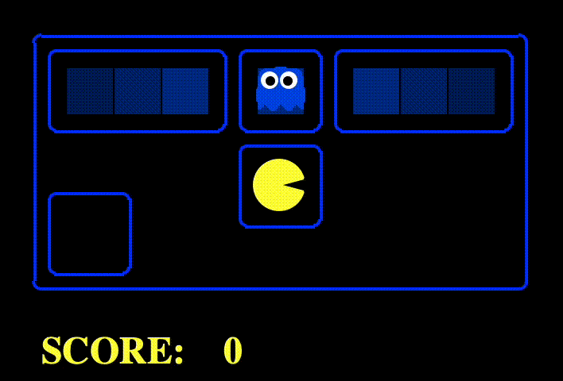

# Bayes Nets and Hidden Markov Models
<p align="center">
    
</p>

$$\text{I can hear you, ghost.
Running won't save you from my
Particle filter!}$$

## Overview
In this project, I designed Pacman agents that use sensors to locate and eat invisible ghosts. They advance from locating single, stationary ghosts to hunting packs of multiple moving ghosts with ruthless efficiency.

Click on [implemented]() (example) to look at specific function.

<br>

Files of main algorithms:

| File                     | Description                                                    |
|--------------------------|----------------------------------------------------------------|
| `bustersAgents.py`       | Agents for playing the Ghostbusters variant of Pacman.         |
| `inference.py`           | Code for tracking ghosts over time using their sounds.         |
| `factorOperations.py`    | Operations to compute new joint or marginalized probability tables.|

Files you might want to look at:

| File          | Description                           |
|---------------|---------------------------------------|
| `bayesNet.py` | The BayesNet and Factor classes.      |

Supporting files you can ignore:

| File                        | Description                                                         |
|-----------------------------|---------------------------------------------------------------------|
| `busters.py`                | The main entry to Ghostbusters (replacing Pacman.py).               |
| `bustersGhostAgents.py`     | New ghost agents for Ghostbusters.                                  |
| `distanceCalculator.py`     | Computes maze distances, caches results to avoid re-computing.      |
| `game.py`                   | Inner workings and helper classes for Pacman.                       |
| `ghostAgents.py`            | Agents to control ghosts.                                           |
| `graphicsDisplay.py`        | Graphics for Pacman.                                                |
| `graphicsUtils.py`          | Support for Pacman graphics.                                        |
| `keyboardAgents.py`         | Keyboard interfaces to control Pacman.                              |
| `layout.py`                 | Code for reading layout files and storing their contents.           |
| `util.py`                   | Utility functions.                                                  |

<br>

## Ghostbusters and Bayes Nets
Before we begin, we can play the game of Ghostbusters, the goal is to hunt down scared but invisible ghosts. Pacman, ever resourceful, is equipped with sonar (ears) that provides noisy readings of the Manhattan distance to each ghost. The game ends when Pacman has eaten all the ghosts. To start, try playing a game using the keyboard.
```python
python busters.py
```

<p align="center">
    
</p>

The blocks of color indicate where the each ghost could possibly be, given the noisy distance readings provided to Pacman. The noisy distances at the bottom-right of the display indicates how far each ghosts are, they are always non-negative, and always within 7 of the true distance. The probability of a distance reading decreases exponentially with its difference from the true distance.


## 1. Bayes Net Structure
I implemented the [`constructBayesNet`](https://github.com/JC01111/Pacman-AI-Projects/blob/b5cdff8dd5e6af5198bf26f49c6866b78e56574a/tracking/inference.py#L31) function in `inference.py`. It constructs an empty Bayes Net with the structure described below.

The simplified ghost hunting world is generated according to the following Bayes net:

<p align="center">
    
</p>

## 2. Join Factors
In this section, I implemented the [`joinFactors`](https://github.com/JC01111/Pacman-AI-Projects/blob/b5cdff8dd5e6af5198bf26f49c6866b78e56574a/tracking/factorOperations.py#L62) function in `factorOperations.py`. It takes in a list of `Factor`s and returns a new `Factor` whose probability entries are the product of the corresponding rows of the input `Factor`s.

`joinFactors` can be used as the product rule, for example, if we have a factor of the form $P(X \mid Y)$ and another factor of the form $P(Y)$, then joining these factors will yield $P(X, Y)$. So, `joinFactors` allows us to incorporate probabilities for conditioned variables (in this case, $Y$). However, you should not assume that `joinFactors` is called on probability tables – it is possible to call `joinFactors` on `Factor`s whose rows do not sum to 1.

Here are some examples of what `joinFactors` can do:
  - `joinFactors`$(P(X \mid Y), P(Y)) = P(X, Y)$
  - `joinFactors`$(P(V, W \mid X, Y, Z), P(X, Y \mid Z)) = P(V, W, X, Y \mid Z)$
  - `joinFactors`$(P(X \mid Y, Z), P(Y)) = P(X, Y \mid Z)$
  - `joinFactors`$(P(V \mid W), P(X \mid Y), P(Z)) = P(V, X, Z \mid W, Y)$

## 3. Eliminate
I implemented the [`eliminate`](https://github.com/JC01111/Pacman-AI-Projects/blob/b5cdff8dd5e6af5198bf26f49c6866b78e56574a/tracking/factorOperations.py#L135) function in `factorOperations.py`. It takes a Factor and a variable to eliminate and returns a new Factor that does not contain that variable. This corresponds to summing all of the entries in the Factor which only differ in the value of the variable being eliminated.

Here are some examples that `eliminate` can be used to marginalize variables from probability tables:
- `eliminate`$(P(X, Y \mid Z), Y) = P(X \mid Z)$
- `eliminate`$(P(X, Y \mid Z), X) = P(Y \mid Z)$

## 4. Variable Elimination
I implemented the [`inferenceByVariableElimination`](https://github.com/JC01111/Pacman-AI-Projects/blob/b5cdff8dd5e6af5198bf26f49c6866b78e56574a/tracking/inference.py#L157) function in `inference.py`. It answers a probabilistic query, which is represented using a `BayesNet`, a list of query variables, and the evidence.

## 5.1 DiscreteDistribution Class
Unfortunately, having timesteps will grow our graph far too much for variable elimination to be viable. Instead, we will use the Forward Algorithm for HMM’s for exact inference, and Particle Filtering for even faster but approximate inference. 

In this project, we use `DiscreteDistribution` class defined in `inference.py` to model belief distributions and weight distributions. This class is an extension of the built-in Python dictionary class, where the keys are the different discrete elements of our distribution, and the corresponding values are proportional to the belief or weight that the distribution assigns that element. 

First, I implemented the [`normalize`](https://github.com/JC01111/Pacman-AI-Projects/blob/b5cdff8dd5e6af5198bf26f49c6866b78e56574a/tracking/inference.py#L347) method, which normalizes the values in the distribution to sum to one, but keeps the proportions of the values the same. Use the total method to find the sum of the values in the distribution. For an empty distribution or a distribution where all of the values are zero, do nothing. Note that this method modifies the distribution directly, rather than returning a new distribution.

Second, I implemented the [`sample`](https://github.com/JC01111/Pacman-AI-Projects/blob/b5cdff8dd5e6af5198bf26f49c6866b78e56574a/tracking/inference.py#L377) method, which draws a sample from the distribution, where the probability that a key is sampled is proportional to its corresponding value. Assume that the distribution is not empty, and not all of the values are zero. Note that the distribution does not necessarily have to be normalized prior to calling this method.

## 5.2 Observation Probability
In this section, I implemented the [`getObservationProb`](https://github.com/JC01111/Pacman-AI-Projects/blob/b5cdff8dd5e6af5198bf26f49c6866b78e56574a/tracking/inference.py#L474) method in the `InferenceModule` base class in `inference.py`. This method takes in an observation (which is a noisy reading of the distance to the ghost), Pacman’s position, the ghost’s position, and the position of the ghost’s jail, and returns the probability of the noisy distance reading given Pacman’s position and the ghost’s position. In other words, we want to return $P(noisyDistance \mid pacmanPosition, ghostPosition)$.

The distance sensor has a probability distribution over distance readings given the true distance from Pacman to the ghost. This distribution is modeled by the function `busters.getObservationProbability(noisyDistance, trueDistance)`, which returns $P(noisyDistance \mid trueDistance)$.

## 6. Exact Inference Observation
In this part, I implemented the [`observeUpdate`](https://github.com/JC01111/Pacman-AI-Projects/blob/b5cdff8dd5e6af5198bf26f49c6866b78e56574a/tracking/inference.py#L585) method in `ExactInference` class of `inference.py` to correctly update the agent’s belief distribution over ghost positions given an observation from Pacman’s sensors. It performed online belief update for observing new evidence. The `observeUpdate` method should, for this part, update the belief at every position on the map after receiving a sensor reading.

Use this command to visulaize the output:
```python
python autograder.py -q q6
```
$$\text{Test 1}$$

<p align="center">
    
</p>

$$\text{Test 2}$$

<p align="center">


$$\text{Test 3}$$

<p align="center">


$$\text{Test 4}$$

<p align="center">


<br>

## 7. Exact Inference with Time Elapse
In the previous part I implemented belief updates for Pacman based on his observations. Fortunately, Pacman’s observations are not his only source of knowledge about where a ghost may be. Pacman also has knowledge about the ways that a ghost may move; namely that the ghost can not move through a wall or more than one space in one time step.

To understand why this is useful to Pacman, consider the following scenario in which there is Pacman and one Ghost. Pacman receives many observations which indicate the ghost is very near, but then one which indicates the ghost is very far. The reading indicating the ghost is very far is likely to be the result of a buggy sensor. Pacman’s prior knowledge of how the ghost may move will decrease the impact of this reading since Pacman knows the ghost could not move so far in only one move.

So, I implemented the [`elapseTime`](https://github.com/JC01111/Pacman-AI-Projects/blob/b5cdff8dd5e6af5198bf26f49c6866b78e56574a/tracking/inference.py#L615) method in `ExactInference`. The `elapseTime` step should, for this part, update the belief at every position on the map after one time step elapsing.

Mini-forward algorithm and the forward algorithm:
$$P(W_{t+1})=\sum_{w_t} P(W_{t+1}\mid w_t)P(w_t)$$
$$B'(W_{i+1})=\sum_{w_i} P(W_{i+1} \mid w_i) B(w_i)$$

The below diagram shows what the Bayes Net/ Hidden Markov model for what is happening.
<p align="center">
    
</p>

Use this command to visulaize the output:
```python
python autograder.py -q q7
```
$$\text{Test 1}$$

<p align="center">
    
</p>

$$\text{Test 2}$$

<p align="center">


$$\text{Test 3}$$

<p align="center">


$$\text{Test 4}$$

<p align="center">


<br>

Remember that lighter squares indicate that pacman believes a ghost is more likely to occupy that location, and darker squares indicate a ghost is less likely to occupy that location. We notice that as the ghost visits some squares more than other squares, those squares get lighter and the other squares get darker.

## 8. Exact Inference Full Test
Now that Pacman knows how to use both his prior knowledge and his observations when figuring out where a ghost is, he is ready to hunt down ghosts on his own. We will use `observeUpdate` and `elapseTime` implementations together to keep an updated belief distribution, and the simple greedy agent will choose an action based on the latest ditsibutions at each time step. In the simple greedy strategy, Pacman assumes that each ghost is in its most likely position according to his beliefs, then moves toward the closest ghost. Up to this point, Pacman has moved by randomly selecting a valid action.

I implemented the [`chooseAction`](https://github.com/JC01111/Pacman-AI-Projects/blob/b5cdff8dd5e6af5198bf26f49c6866b78e56574a/tracking/bustersAgents.py#L139) method in `GreedyBustersAgent` in `bustersAgents.py`. The agent will first find the most likely position of each remaining uncaptured ghost, then choose an action that minimizes the maze distance to the closest ghost.

We can represent how our greedy agent works with the following modification to the previous diagram (Bayes Net diagram):
<p align="center">
    
</p>

To visualize the output:
```python
python autograder.py -q q8
```

$$\text{Test 1}$$

<p align="center">
    
</p>

$$\text{Test 2}$$

<p align="center">


$$\text{Test 3}$$

<p align="center">


<br>

## 9. Approximate Inference Initialization and Beliefs
For the next few parts, I implemented a particle filtering algorithm for tracking a single ghost.

First, I implemented the functions [`initializeUniformly`](https://github.com/JC01111/Pacman-AI-Projects/blob/b5cdff8dd5e6af5198bf26f49c6866b78e56574a/tracking/inference.py#L660) and [`getBeliefDistribution`](https://github.com/JC01111/Pacman-AI-Projects/blob/b5cdff8dd5e6af5198bf26f49c6866b78e56574a/tracking/inference.py#L678) in the `ParticleFilter` class in `inference.py`. A particle (sample) is a ghost position in this inference problem. For initialization, particles are evenly (not randomly) distributed across legal positions in order to ensure a uniform prior.

## 10. Approximate Inference Observation
Next, I implemented the [`observeUpdate`](https://github.com/JC01111/Pacman-AI-Projects/blob/b5cdff8dd5e6af5198bf26f49c6866b78e56574a/tracking/inference.py#L699) method in the `ParticleFilter` class in `inference.py`. This method constructs a weight distribution over `self.particles` where the weight of a particle is the probability of the observation given Pacman’s position and that particle location. Then, we resample from this weighted distribution to construct our new list of particles. My implementation handles a special case that when all particles receive zero weight, the list of particles would be reinitialized by calling `initializeUniformly`.

_Observation Update_ - During the observation update for particle filtering, we use the sensor model $P(F_i\mid T_i)$ to weight each particle according to the probability dictated by the observed evidence and the particle’s state. Specifically, for a particle in state $t_i$ with sensor reading $f_i$, assign a weight of $P(f_i\mid t_i)$. The algorithm for the observation update is as follows:
1. Calculate the weights of all particles as described above.
2. Calculate the total weight for each state.
3. If the sum of all weights across all states is 0, reinitialize all particles.
4. Else, normalize the distribution of total weights over states and resample your list of particles from this distribution. 

<br>

```python
python autograder.py -q q10
```

<p align="center">


# 11. Approximate Inference with Time Elapse
In this part, I implemented the [`elapseTime`](https://github.com/JC01111/Pacman-AI-Projects/blob/b5cdff8dd5e6af5198bf26f49c6866b78e56574a/tracking/inference.py#L738) function in the `ParticleFilter` class in `inference.py`. This function constructs a new list of particles that corresponds to each existing particle in `self.particles` advancing a time step, and then assign this new list back to `self.particles`. This function tracks ghosts nearly as effectively as with exact inference.

_Time Elapse Update_ - Update the value of each particle according to the transition model. For a particle in state $t_i$, sample the updated value from the probability distribution given by $P(T_{i+1} \mid t_i)$. Note the similarity of the time elapse update to prior sampling with Bayes’ nets, since the frequency of particles in any given state reflects the transition probabilities.

```python
python autograder.py -q q11
```

<p align="center">
